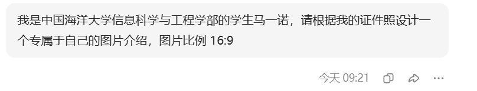
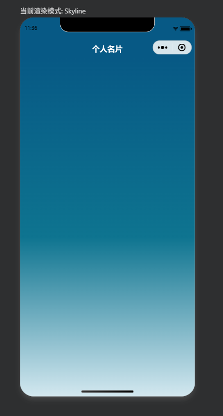
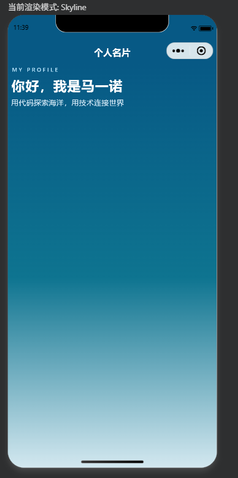
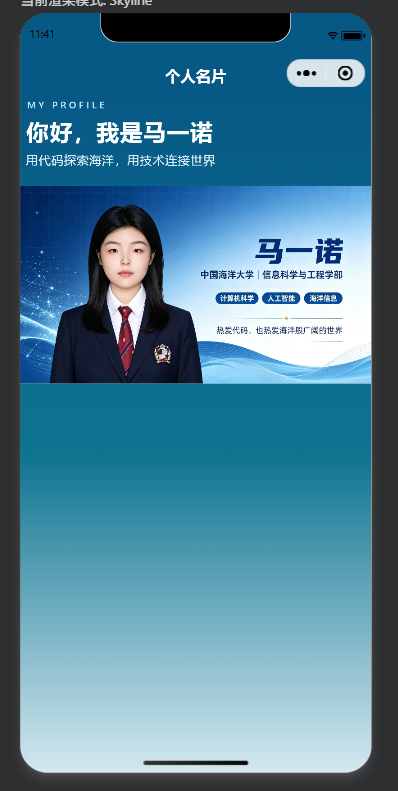
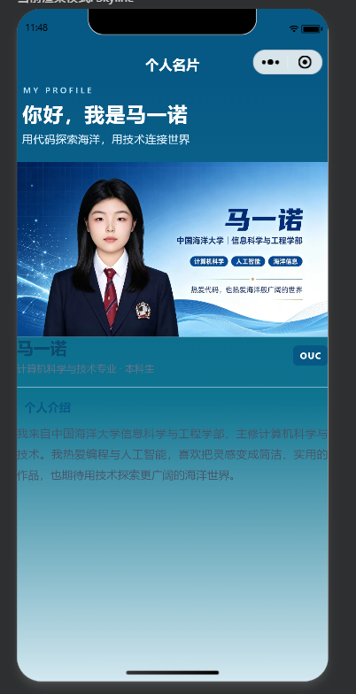
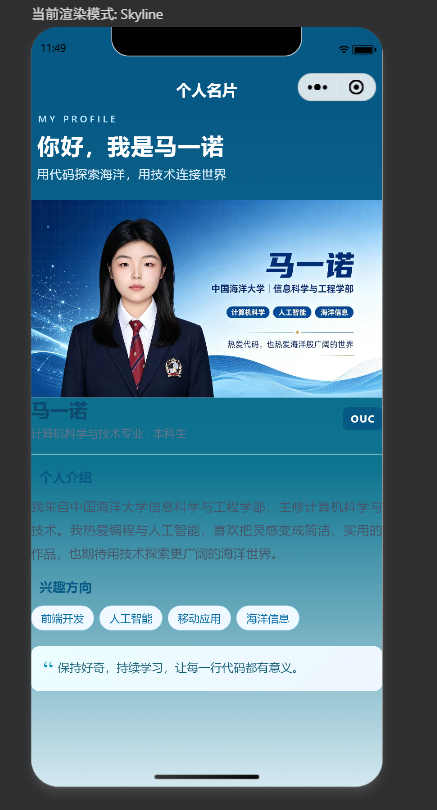
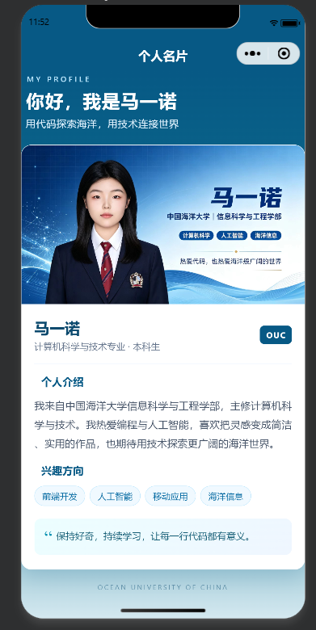
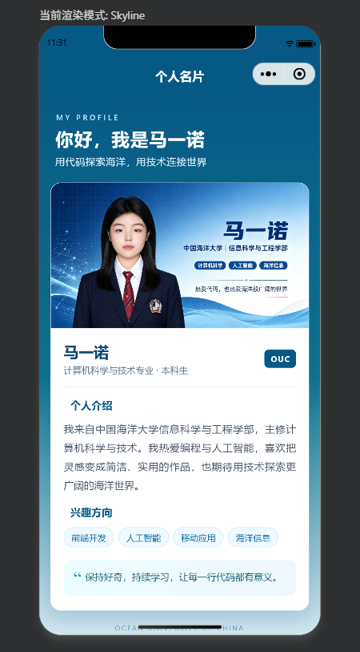

# OUC26夏移动软件开发-实验2

<center>姓名：马一诺  学号：24020007088</center>

| 姓名和学号？         | 马一诺，24020007088                  |
| -------------------- | -------------------------------- |
| 本实验属于哪门课程？ | 中国海洋大学26夏《移动软件开发》 |
| 实验名称？           | 实验2：名片小程序             |
| 博客链接 | https://blog.csdn.net/2604_96828618/article/details/164052078?spm=1011.2415.3001.10575&sharefrom=mp_manage_link |
| github链接 | https://github.com/1-qaz-2-wsx/ouc26-mobile-dev/tree/main/lab2 |

## 一、实验内容

### 1. 用AI生成自己的名片头图

首先向 AI 说明学校、学院、姓名及图片比例等基本要求，提示词如下图所示。为了让头图和后续小程序界面保持统一，我选择了符合中国海洋大学特色的蓝色作为主色调，并在图片中加入姓名、学校、研究兴趣及个人寄语等信息。



AI 生成的图片采用 16:9 横向构图。左侧是个人形象，右侧依次展示姓名、学校、关键词和个人寄语，信息层次比较清晰。生成完成后，将图片命名为 `名片照.jpg`，保存到项目的 `code2/img` 目录中，供小程序页面调用。


### 2. 制作自己的专属微信小程序名片

#### 2.1 页面整体结构设计

本实验主要修改了 `pages/index/index.wxml`、`pages/index/index.wxss` 和 `app.wxss` 三个文件。

其中，WXML 负责组织标题、图片和个人介绍等页面内容；WXSS 负责颜色、字号、间距、圆角及布局；由于页面是静态名片，不涉及用户交互，因此 `index.js` 中只保留 `Page({})` 完成页面注册。

页面最外层使用自定义导航栏和纵向滚动容器：

```wxml
<navigation-bar title="个人名片" back="{{false}}"
  color="#ffffff" background="#075985">
</navigation-bar>

<scroll-view class="page-scroll" scroll-y enhanced
  show-scrollbar="{{false}}">
  <!-- 名片内容 -->
</scroll-view>
```

`navigation-bar` 的 `title` 属性“个人名片”，`back="{{false}}"` 表示首页不需要返回按钮；`scroll-y` 使内容在不同尺寸的手机上都可以纵向滚动，`show-scrollbar="{{false}}"` 隐藏滚动条，使页面更整洁。



#### 2.2 标题区域设计

页面顶部设置英文装饰标题、中文主标题和一句个人主题文案：

```wxml
<view class="hero-heading">
  <text class="eyebrow">MY PROFILE</text>
  <text class="page-title">你好，我是马一诺</text>
  <text class="page-subtitle">用代码探索海洋，用技术连接世界</text>
</view>
```

这里使用 `view` 划分独立区域，使用 `text` 显示文字。三个文本分别绑定不同的 `class`，从而形成由小到大、主次分明的标题层级。背景使用从深海蓝到浅蓝的渐变：

```wxss
.page-scroll {
  height: calc(100vh - 88rpx);
  background: linear-gradient(180deg,
    #075985 0, #0e7490 280rpx, #edf7fc 620rpx);
}
```

`linear-gradient` 使页面从顶部深蓝逐渐过渡到下方浅蓝，既突出白色标题，又与海洋主题相呼应。



#### 2.3 名片头图展示

头图通过 `image` 标签引入：

```wxml
<image class="profile-image"
  src="/img/profile-card.jpg"
  mode="widthFix"
  show-menu-by-longpress="{{true}}">
</image>
```

`src` 指向小程序本地图片；`mode="widthFix"` 让图片宽度充满卡片，同时根据原始 16:9 比例自动计算高度，避免人物、姓名或院系信息被拉伸和裁剪；`show-menu-by-longpress` 允许用户长按图片调出图片菜单。对应样式将图片宽度设为卡片宽度：

```wxss
.profile-image {
  display: block;
  width: 100%;
  background: #dbeafe;
}
```



#### 2.4 个人身份和介绍区域

头图下方使用白色卡片展示姓名、专业和学校缩写：

```wxml
<view class="identity-row">
  <view>
    <text class="name">马一诺</text>
    <text class="identity">计算机科学与技术专业 · 本科生</text>
  </view>
  <text class="school-badge">OUC</text>
</view>
```

该区域使用 Flex 布局，使个人信息位于左侧、`OUC` 徽标位于右侧：

```wxss
.identity-row {
  display: flex;
  align-items: center;
  justify-content: space-between;
}
```

随后通过独立的小节展示个人介绍。`intro-text` 设置较大的行高和两端对齐，使长段文字阅读起来更加清晰：

```wxss
.intro-text {
  display: block;
  margin-top: 18rpx;
  font-size: 27rpx;
  line-height: 1.85;
  text-align: justify;
}
```



#### 2.5 兴趣标签和个人寄语

使用多个 `text` 标签展示兴趣方向：

```wxml
<view class="tag-list">
  <text class="tag">前端开发</text>
  <text class="tag">人工智能</text>
  <text class="tag">移动应用</text>
  <text class="tag">海洋信息</text>
</view>
```

标签容器使用 `display: flex` 和 `flex-wrap: wrap`。当屏幕宽度不足时，标签会自动换行，从而适配不同型号的手机。每个标签使用浅蓝背景、蓝色文字和胶囊形圆角，保证整体风格一致。

页面底部加入个人寄语：

```wxml
<view class="motto">
  <text class="quote-mark">“</text>
  <text class="motto-text">保持好奇，持续学习，让每一行代码都有意义。</text>
</view>
```

该区域使用浅蓝渐变背景和装饰引号，与主要内容形成区别，同时使名片内容更加完整。



#### 2.6 卡片效果与移动端适配

名片主体通过圆角、白色背景和阴影形成悬浮卡片效果：

```wxss
.profile-card {
  overflow: hidden;
  border-radius: 28rpx;
  background: #ffffff;
  box-shadow: 0 20rpx 55rpx rgba(7, 89, 133, 0.18);
}
```

`overflow: hidden` 可以保证顶部图片不会超出卡片圆角；`box-shadow` 增强卡片与背景之间的层次。页面尺寸主要使用微信小程序的 `rpx` 单位。小程序会根据设备屏幕宽度自动换算 `rpx`，因此标题、间距和卡片在不同屏幕上能保持相对一致的比例。



```wxss
.page-shell { padding: 48rpx 30rpx 52rpx; box-sizing: border-box; }
```

最终效果图：





## 二、问题总结与体会

### 1. 实验中遇到的问题及解决方法

（1）**横向头图在手机页面中容易被裁剪或变形。**使用 `mode="widthFix"`，让高度根据图片原始比例自动计算，较好地保留了头图的全部内容。

（2）**页面内容超过一屏。** 名片除头图外还包含个人介绍、标签和寄语，在较小的设备上无法一次显示完整。解决方法是使用 `scroll-y` 属性的 `scroll-view` 作为外层容器，使页面能够纵向滚动

（3）**移动端尺寸适配问题。** 固定像素在不同手机上的视觉大小可能不一致。本实验主要使用 `rpx` 设置字号、内外边距和圆角，并使用 Flex 布局完成左右对齐和标签自动换行，从而提高不同屏幕尺寸下的适应能力。

### 2. 实验收获与体会

通过本次实验，我掌握了微信小程序页面的基本组成，理解了 WXML、WXSS文件之间的分工：WXML 决定页面结构，WXSS 决定视觉效果。同时进一步熟悉了 `view`、`text`、`image`、`scroll-view` 等常用标签，以及 Flex 布局、渐变背景、圆角阴影和响应式单位 `rpx` 的使用方法。
